# Through the Eyes of AI: Brand Perception of Robotaxis in LLM Search

## Project Overview

As **generative AI tools** rapidly become mainstream for everyday search and decision-making, **how companies are portrayed** by these models directly shapes public perception. In this project, I collected responses from two leading LLMs—GPT-4o and Claude Sonnet 3.7—using a structured prompt strategy. By analyzing company mentions and sentiment across key factors (e.g., safety, pricing, technology), I aimed to uncover how each major **autonomous driving company** is described in AI-driven “search” and **provide data-backed insights** into optimizing *LLM-based SEO* strategies.

### Background

According to **Gartner** and **HubSpot**, over half of Gen Z and Millennials now use AI tools to search for information. This has major implications for companies like **Waymo**, **Cruise**, and **Tesla**, as **LLMs can influence brand trust and consumer decisions**.

Simultaneously, the autonomous driving industry is entering a critical public-facing stage. **Public trust**, regulatory landscapes, and **technical maturity** are all in flux. As these services expand into everyday use, **AI-generated answers** to questions such as *“Which self-driving service is the safest?”* or *“Which one is available in my city?”* will heavily shape public perception.

### Key Insights

- **Waymo** consistently ranks #1 in **safety, technology, and availability** across structured LLM responses. However, it scores **lowest in sentiment** because **industry-wide concerns** often get projected onto its brand in free-text responses.
- **Filtered word clouds** reveal more nuanced brand identities:
  - *Zoox*: innovation, design
  - *Tesla*: driver-assist features, brand visibility
  - *Cruise*: regulatory complexities, competitive pricing
  - *Waymo*: large-scale deployment
- **Terminology matters**: Varying phrases—*robotaxi*, *driverless car*, *autonomous vehicle*—can shift which companies dominate search results, indicating a potential **LLM SEO gap** for some players.
- **Model-specific differences**: GPT-4 and Claude often converge on top companies (Waymo, Tesla, Cruise), yet differ slightly in **tone** and how strongly they associate *new entrants* like Zoox or Chinese AV firms.

By **quantifying** these mentions and sentiment trends, I demonstrate how LLM-based “search” can deviate from traditional SEO, demanding **new brand strategies** for the autonomous vehicle industry.

### Methods & Technical Approach

This project combines **structured** (ranked lists) and **unstructured** (long-form text) outputs from **OpenAI GPT-4** and **Anthropic Claude** to quantitatively evaluate each company's brand perception in AI-driven “search.” The following sections outline the key workflows and scripts used.

### Data Collection & Preprocessing

* **LLM Data Gathering**
  OpenAI GPT-4 (Chat Completions API) and Anthropic Claude (web interface) were prompted with multiple queries across categories such as safety, technology, and pricing.
* **Cleaning & Formatting**
  * `ranking-analysis.py`: Reads `ranked_combined.csv` into a Pandas DataFrame, parses JSON-like rank entries, and applies a weighted scoring system (e.g., `chatgpt_weight = 0.8`, `claude_weight = 0.2`) to reflect relative confidence. The script then outputs aggregated category- and service-term scores.
  * `long-response-analysis.py`: Loads `long_response_combined.csv`, removes URLs, punctuation, and stopwords (using Regex and TextBlob), and organizes the cleaned corpus for sentiment and keyword analysis.

### Analysis & Visualization

* **Rankings & Scores**: Raw 1–5 rankings are converted into numeric point values (1st = 5 points, 2nd = 4, etc.) in `ranking-analysis.py`. These are combined into a **Combined_WeightedScore** to show how often each brand leads in various categories.
* **Sentiment & Keyword Frequency**: `long-response-analysis.py` applies TextBlob to compute a polarity score (−1.0 to +1.0) for each LLM response. It also uses CountVectorizer to identify the most frequent words, revealing brand-specific language once common terms like “safety” are filtered out.
* **Visual Outputs**: `ranking-visualization.py` generates radar, pie, and bar charts illustrating company performance and overall “dominance” across categories. Word clouds, created in `long-response-analysis.py`, give a quick snapshot of recurring themes in each brand’s descriptions.

### Tools & Technologies

- **Python & Pandas**: Data ingestion, cleaning, aggregation
- **Regex**: Basic text preprocessing
- **TextBlob**: Sentiment scoring
- **Matplotlib**: Radar, pie, and bar chart creation
- **WordCloud & scikit-learn**: Keyword frequency extraction and visualization
- **JSON / CSV**: Structured data formats for reproducible pipelines

---

## LLM Rankings of Robotaxi Companies

### Research Method: Prompting Strategy

This research employs a structured prompting methodology to analyze how LLMs portray robotaxi companies across key consumer decision factors. The framework balances consistency and variation to provide comparable data points while exploring different dimensions of perception.

<pre class="font-styrene border-border-100/50 overflow-x-scroll w-full rounded border-[0.5px] shadow-[0_2px_12px_hsl(var(--always-black)/5%)]"><table class="bg-bg-100 min-w-full border-separate border-spacing-0 text-sm leading-[1.88888] whitespace-normal"><thead class="border-b-border-100/50 border-b-[0.5px] text-left"><tr class="[tbody>&]:odd:bg-bg-500/10"><th class="text-text-000 [&:not(:first-child)]:-x-[hsla(var(--border-100) / 0.5)] font-400 px-2 [&:not(:first-child)]:border-l-[0.5px]">Category</th><th class="text-text-000 [&:not(:first-child)]:-x-[hsla(var(--border-100) / 0.5)] font-400 px-2 [&:not(:first-child)]:border-l-[0.5px]">Focus Area</th><th class="text-text-000 [&:not(:first-child)]:-x-[hsla(var(--border-100) / 0.5)] font-400 px-2 [&:not(:first-child)]:border-l-[0.5px]">Example Prompt</th></tr></thead><tbody><tr class="[tbody>&]:odd:bg-bg-500/10"><td class="border-t-border-100/50 [&:not(:first-child)]:-x-[hsla(var(--border-100) / 0.5)] border-t-[0.5px] px-2 [&:not(:first-child)]:border-l-[0.5px]"><strong>General</strong></td><td class="border-t-border-100/50 [&:not(:first-child)]:-x-[hsla(var(--border-100) / 0.5)] border-t-[0.5px] px-2 [&:not(:first-child)]:border-l-[0.5px]">Overall market position</td><td class="border-t-border-100/50 [&:not(:first-child)]:-x-[hsla(var(--border-100) / 0.5)] border-t-[0.5px] px-2 [&:not(:first-child)]:border-l-[0.5px]">"Rank the top 5 robotaxi companies in the US today."</td></tr><tr class="[tbody>&]:odd:bg-bg-500/10"><td class="border-t-border-100/50 [&:not(:first-child)]:-x-[hsla(var(--border-100) / 0.5)] border-t-[0.5px] px-2 [&:not(:first-child)]:border-l-[0.5px]"><strong>Safety</strong></td><td class="border-t-border-100/50 [&:not(:first-child)]:-x-[hsla(var(--border-100) / 0.5)] border-t-[0.5px] px-2 [&:not(:first-child)]:border-l-[0.5px]">Risk assessment & protection</td><td class="border-t-border-100/50 [&:not(:first-child)]:-x-[hsla(var(--border-100) / 0.5)] border-t-[0.5px] px-2 [&:not(:first-child)]:border-l-[0.5px]">"Which robotaxi companies are considered the safest in the industry?"</td></tr><tr class="[tbody>&]:odd:bg-bg-500/10"><td class="border-t-border-100/50 [&:not(:first-child)]:-x-[hsla(var(--border-100) / 0.5)] border-t-[0.5px] px-2 [&:not(:first-child)]:border-l-[0.5px]"><strong>Technology</strong></td><td class="border-t-border-100/50 [&:not(:first-child)]:-x-[hsla(var(--border-100) / 0.5)] border-t-[0.5px] px-2 [&:not(:first-child)]:border-l-[0.5px]">Innovation & technical capability</td><td class="border-t-border-100/50 [&:not(:first-child)]:-x-[hsla(var(--border-100) / 0.5)] border-t-[0.5px] px-2 [&:not(:first-child)]:border-l-[0.5px]">"Which robotaxi companies have the most advanced self-driving technology?"</td></tr><tr class="[tbody>&]:odd:bg-bg-500/10"><td class="border-t-border-100/50 [&:not(:first-child)]:-x-[hsla(var(--border-100) / 0.5)] border-t-[0.5px] px-2 [&:not(:first-child)]:border-l-[0.5px]"><strong>Availability</strong></td><td class="border-t-border-100/50 [&:not(:first-child)]:-x-[hsla(var(--border-100) / 0.5)] border-t-[0.5px] px-2 [&:not(:first-child)]:border-l-[0.5px]">Geographic coverage & access</td><td class="border-t-border-100/50 [&:not(:first-child)]:-x-[hsla(var(--border-100) / 0.5)] border-t-[0.5px] px-2 [&:not(:first-child)]:border-l-[0.5px]">"Which robotaxi companies have the widest operational availability in terms of cities and regions?"</td></tr><tr class="[tbody>&]:odd:bg-bg-500/10"><td class="border-t-border-100/50 [&:not(:first-child)]:-x-[hsla(var(--border-100) / 0.5)] border-t-[0.5px] px-2 [&:not(:first-child)]:border-l-[0.5px]"><strong>Service</strong></td><td class="border-t-border-100/50 [&:not(:first-child)]:-x-[hsla(var(--border-100) / 0.5)] border-t-[0.5px] px-2 [&:not(:first-child)]:border-l-[0.5px]">Customer experience</td><td class="border-t-border-100/50 [&:not(:first-child)]:-x-[hsla(var(--border-100) / 0.5)] border-t-[0.5px] px-2 [&:not(:first-child)]:border-l-[0.5px]">"Which robotaxi companies offer the best overall customer service experience?"</td></tr><tr class="[tbody>&]:odd:bg-bg-500/10"><td class="border-t-border-100/50 [&:not(:first-child)]:-x-[hsla(var(--border-100) / 0.5)] border-t-[0.5px] px-2 [&:not(:first-child)]:border-l-[0.5px]"><strong>Pricing</strong></td><td class="border-t-border-100/50 [&:not(:first-child)]:-x-[hsla(var(--border-100) / 0.5)] border-t-[0.5px] px-2 [&:not(:first-child)]:border-l-[0.5px]">Cost & value</td><td class="border-t-border-100/50 [&:not(:first-child)]:-x-[hsla(var(--border-100) / 0.5)] border-t-[0.5px] px-2 [&:not(:first-child)]:border-l-[0.5px]">"Which robotaxi companies offer the most competitive pricing for customers?"</td></tr></tbody></table></pre>

1. **Terminology Variation** : Each prompt is repeated using four different industry terms ("robotaxi," "self-driving car," "autonomous vehicle," "driverless car") to identify potential shifts in perception based on terminology.
2. **Standardized Output** : All prompts request results in identical JSON format: `{1: 'Best Company Name', 2: 'Second Best Company Name', ...}` This enables direct comparison across models and eliminates formatting variations.
3. **Question Structure** :

* Basic queries: Direct questions about category rankings
* Enhanced queries: Include specific evaluation criteria (e.g., "Considering crash avoidance, system redundancy, and public safety reports...")

### Key Insights from LLM-Generated Brand Perception Charts

#### 1. Company Performance Profiles: Radar Charts

  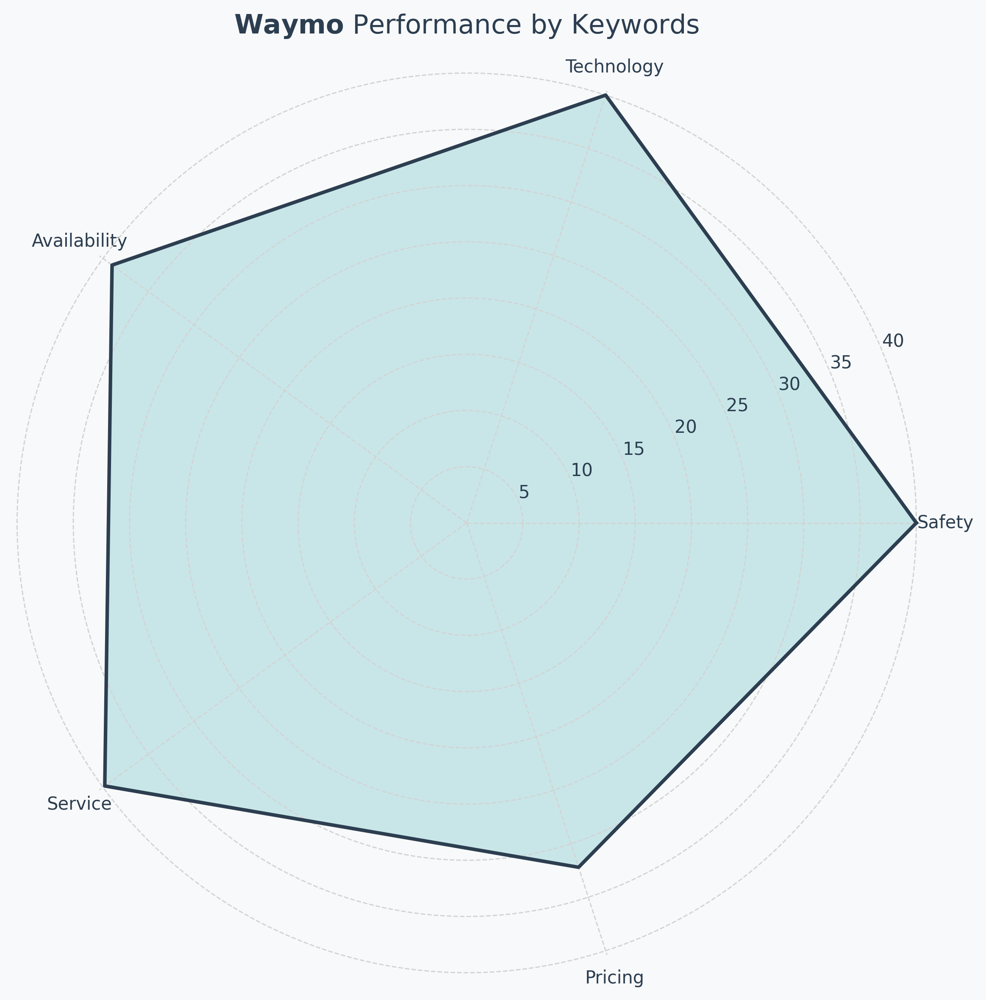
  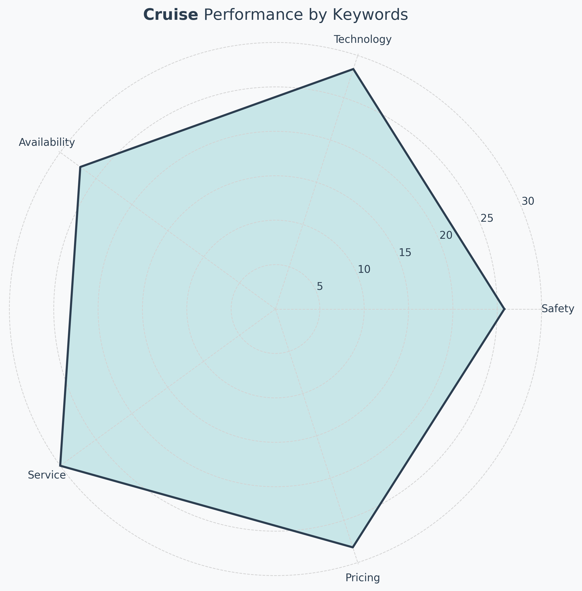
  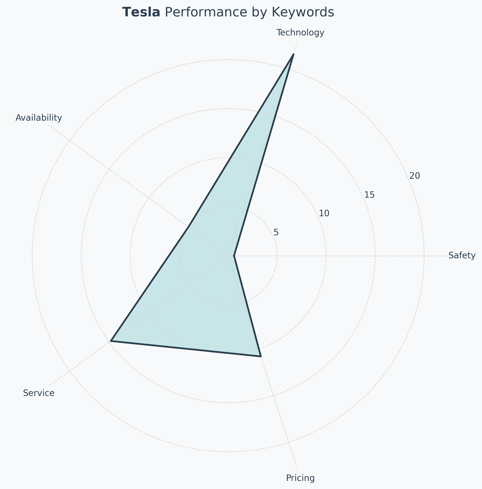
  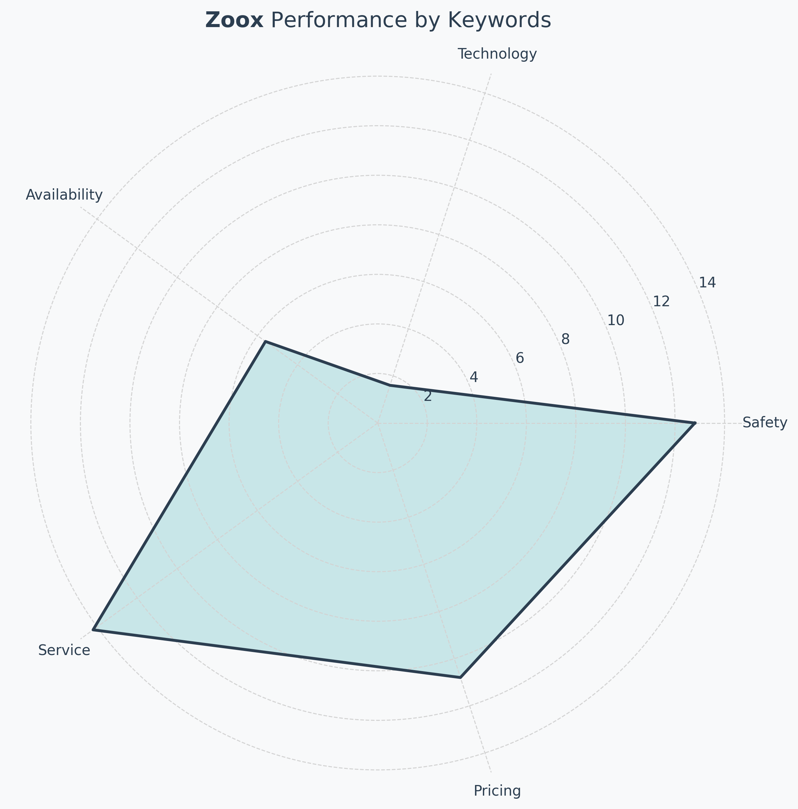

Each radar chart reveals how a company is positioned across multiple consumer-relevant categories, excluding generic mentions.

**Observations:**

* **Waymo** consistently leads in *Safety*, *Availability*, and T*echnology*, indicating a strong and broad-based reputation in LLM responses.
* **Cruise** tends to follow closely, especially in *Availability* and *Pricing*, suggesting its brand is seen as accessible and competitively priced.
* **Tesla**, while well-known, receives a more uneven portrayal—ranking high in *Technology* but often lower in *Service* and *Safety*, likely reflecting mixed media narratives.
* **Zoox** shows moderate visibility with a balanced profile, though often overshadowed by bigger players in specific categories.

#### 2. Keyword-Based Competitive Dominance

  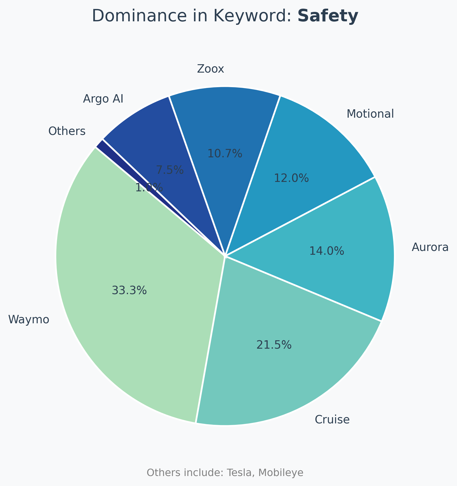
  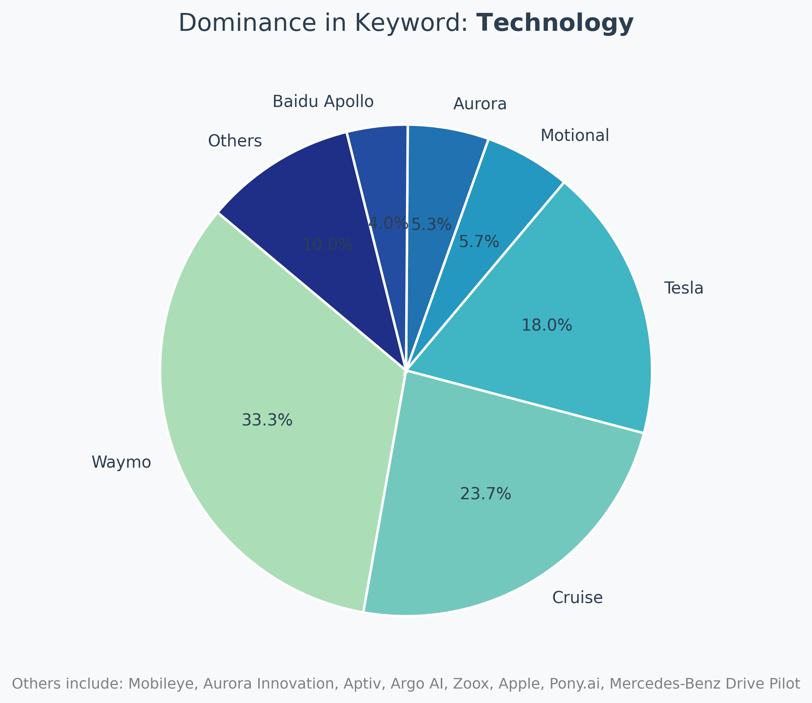
  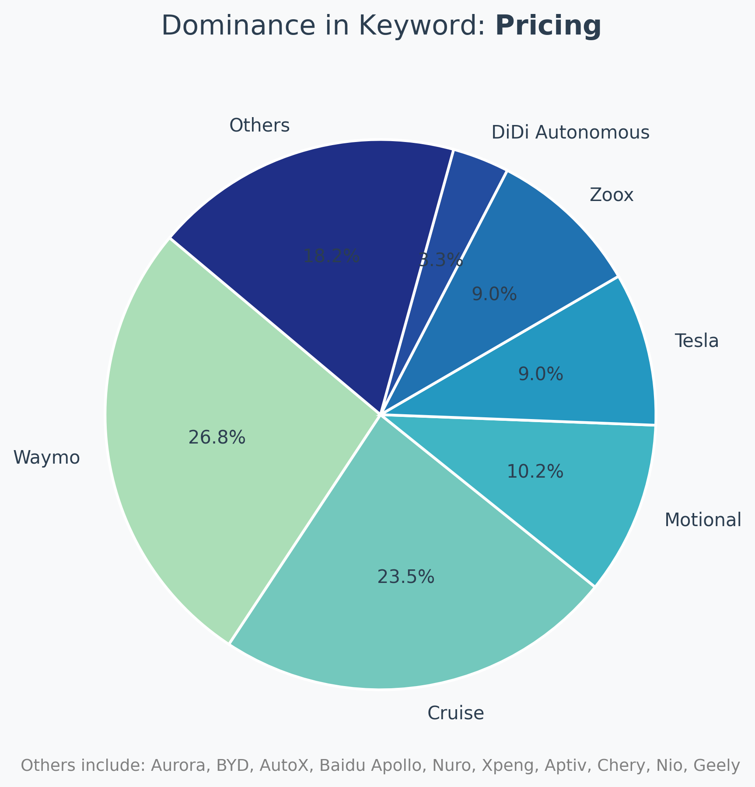
  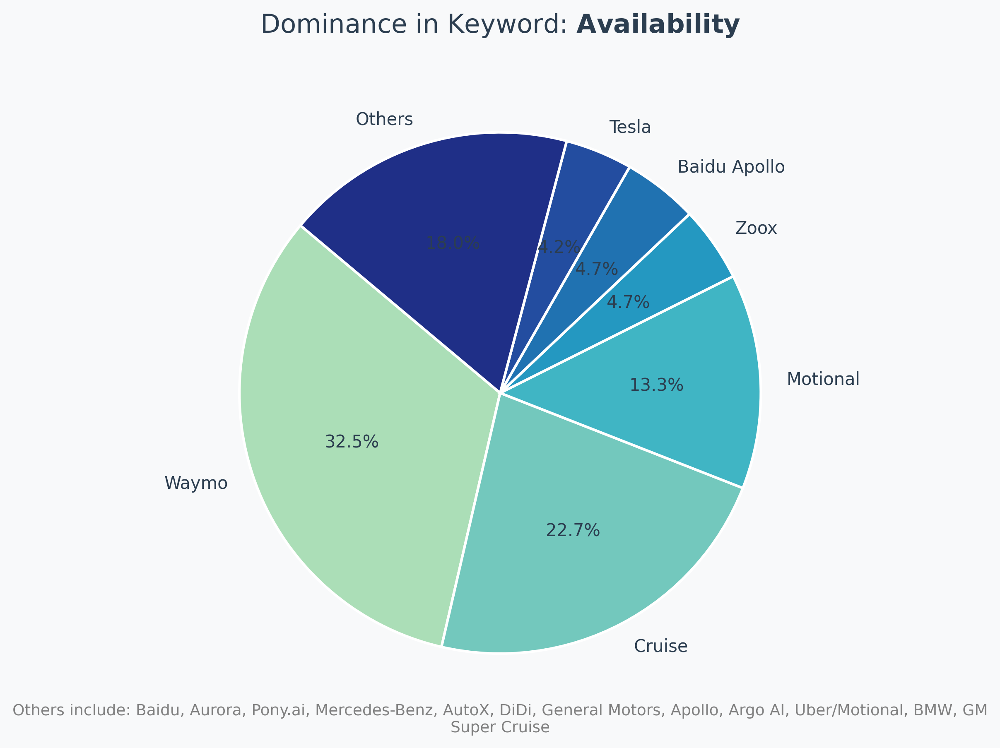
  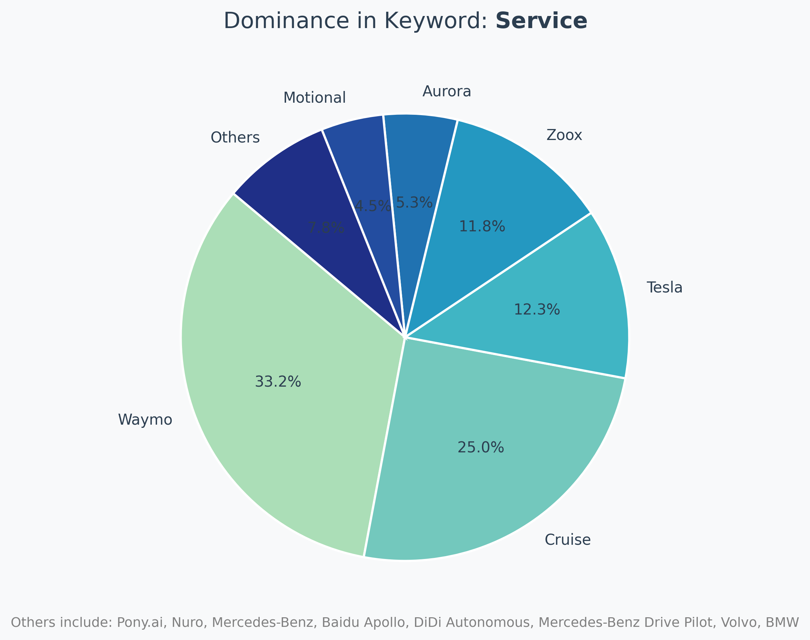

**Observations:**

* **Waymo** dominates across the majority of categories, particularly *Safety* and *Availability*, reinforcing its reputation as the "default" leader.
* The **“Others”** category includes a meaningful presence from **Chinese robotaxi firms**, especially in *Technology,* *Availability,* and *Pricing* categories. Companies like **Baidu (Apollo Go)** and **Didi** frequently appear here, indicating that LLMs recognize their growing influence, even if they don’t yet dominate individual rankings.

#### 3. Terminology Based Competitive Dominance

**Observations:**

  
  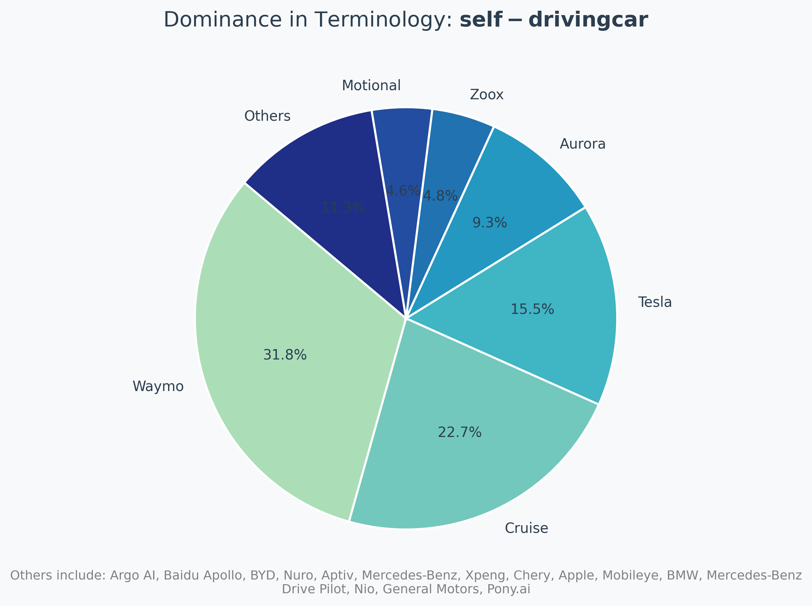
  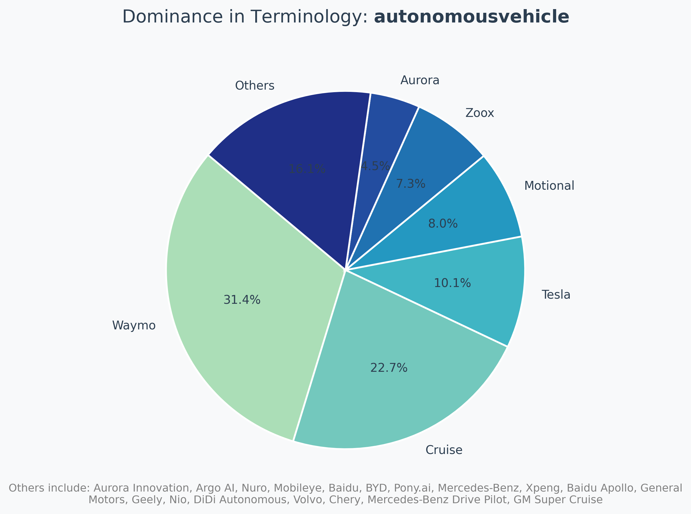
  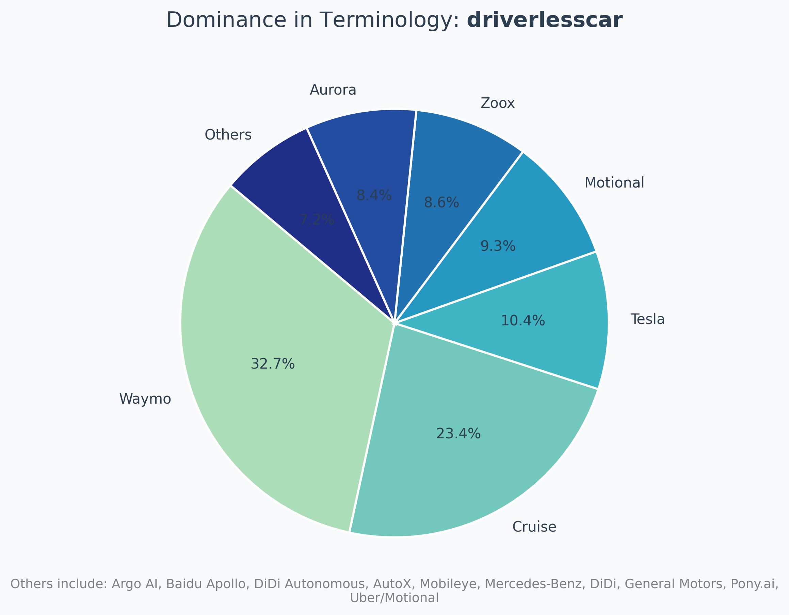

* The term **“robotaxi”** favors U.S.-based commercial services like Waymo and Cruise.
* In contrast, **“autonomous vehicle”** or **“driverless car”** often surfaces Chinese players like **Apollo Go** and  **AutoX** , reflecting their visibility in technical and international contexts.
* **Consistency gaps** emerge: some companies appear under one term but vanish under another, indicating a potential **SEO blind spot** in how they’re described.

---

## Analyzing LLM Language: Topics and Themes in Long-Form Responses

To deepen the analysis of LLM-based brand perception, this next phase shifts from structured rankings to long-form, free-text responses. While rankings reveal who is favored in each category, long-form analysis explores how companies are described—what language, narratives, and themes consistently appear.

### Research Questions

As part of the long-form analysis, this phase focuses on the following guiding questions:

* **What emotional tone do LLMs use when describing each robotaxi brand—and how does it vary by company?**
  This explores whether certain brands are described using more positive, neutral, or negative language, and how those differences reflect public sentiment, media narratives, or model biases.
* **What specific themes (e.g., safety, innovation, accessibility) do LLMs link to specific companies, and how distinct are their brand identities in AI responses?**
  This investigates whether companies like Waymo, Cruise, or Tesla have clear thematic “footprints” in LLM-generated content—or if there is significant overlap in how they’re described.

### Research Method: Prompt Groups

| **Prompt Group**                      | **Research Focus**                                            | **Example Prompts**                                                                                                                                                                          |
| ------------------------------------------- | ------------------------------------------------------------------- | -------------------------------------------------------------------------------------------------------------------------------------------------------------------------------------------------- |
| **1. General Brand Perception**       | Understand overall sentiment and tone toward each company           | - How would you describe the reputation of [Company Name]? - What are the pros and cons of using [Company Name]? - How do people generally feel about [Company Name] compared to others? |
| **2. Brand Trust & Confidence**       | Explore whether companies are framed as safe, credible, or reliable | - Would you consider [Company Name] a trustworthy company in the robotaxi space? - Is [Company Name] considered a safe choice by the public and experts?                                      |
| **3. Brand Associations & Strengths** | Identify themes and differentiators associated with each brand      | - What are [Company Name]’s key strengths as a robotaxi provider? - What is [Company Name] known for in the industry? - What makes [Company Name] stand out from competitors?           |

Each prompt is submitted to **both ChatGPT (GPT-4)** and **Claude**, using the set of companies, including: `Waymo`, `Cruise`, `Tesla`, `Zoox`

### Key Insights from Long Responses Text Analysis

#### 1. Sentiment Analysis: Emotional Tone vs. Perceived Leadership

  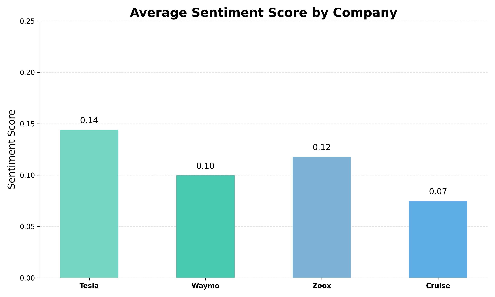
  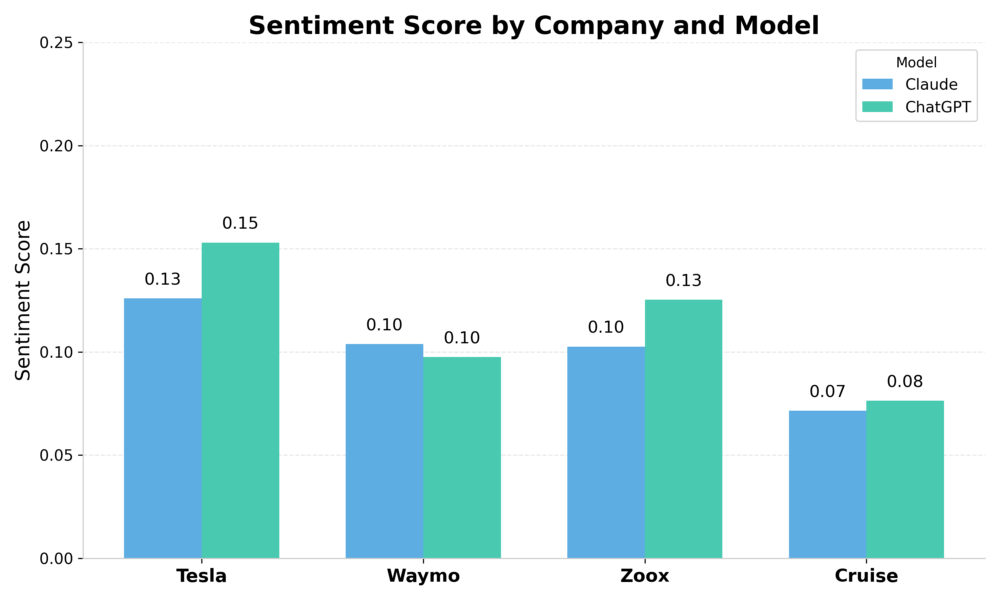

Using **Textblob**, I labeled the **positive sentiment score** of long-form, free-text LLM responses and calculated the average. Interestingly, **Waymo** scored 0.10 (scale 0–1), while **Tesla** and **Cruised** scored 0.14 and 0.12, respectively.

**Interpretation**: Because Waymo is so deeply linked to the industry at large, **negative sentiments** or public skepticism about self-driving technology (crash safety, AI ethics, etc.) often appear in Waymo’s descriptions. In contrast, smaller or newer brands (like Zoox) may not evoke the same intensity of controversy, resulting in a neutral-to-positive average sentiment.

#### 2. Thematic Language

After filtering out dominant, overrepresented keywords like “safety” and “technology”, we identified the secondary keywords that uniquely associate with each company — highlighting how LLMs frame each brand at a narrative level:

  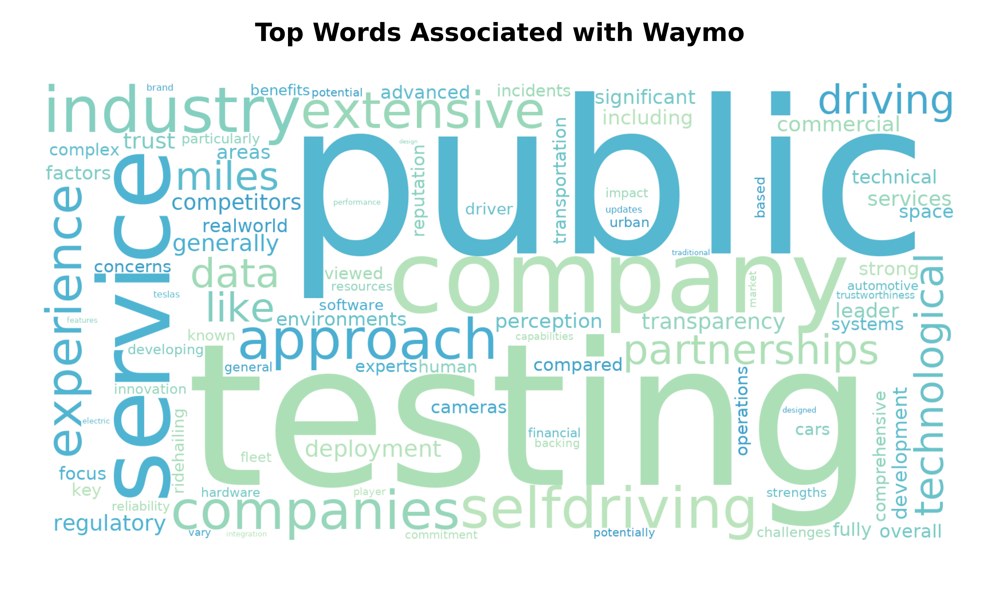
  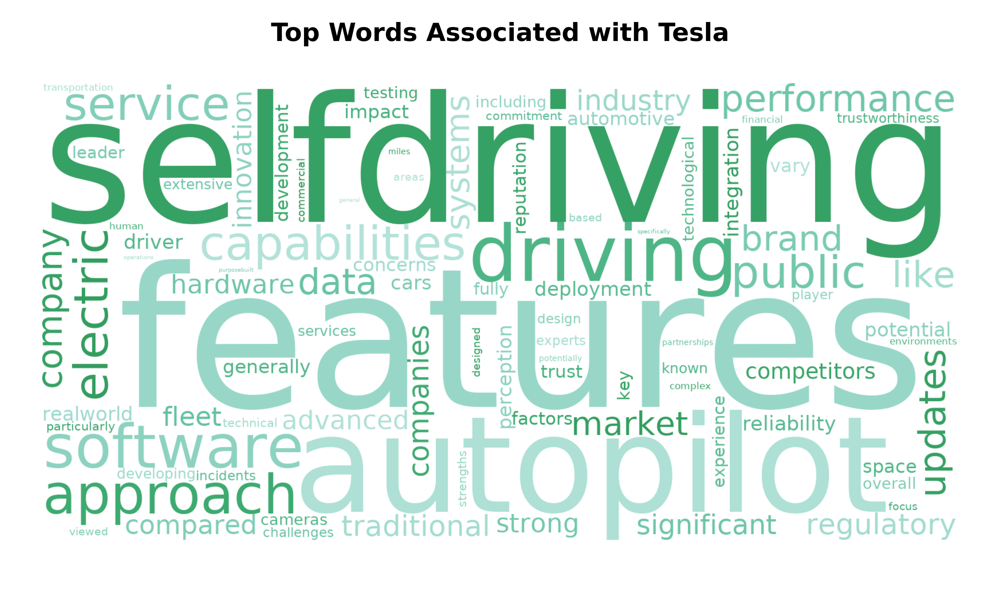
  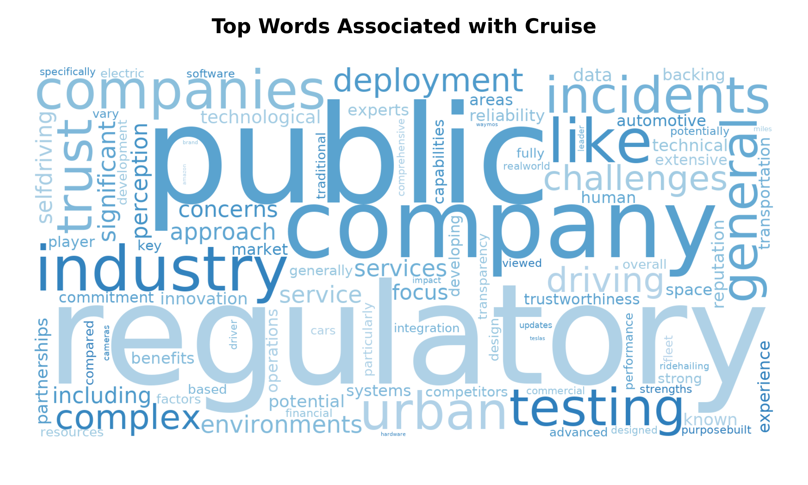
  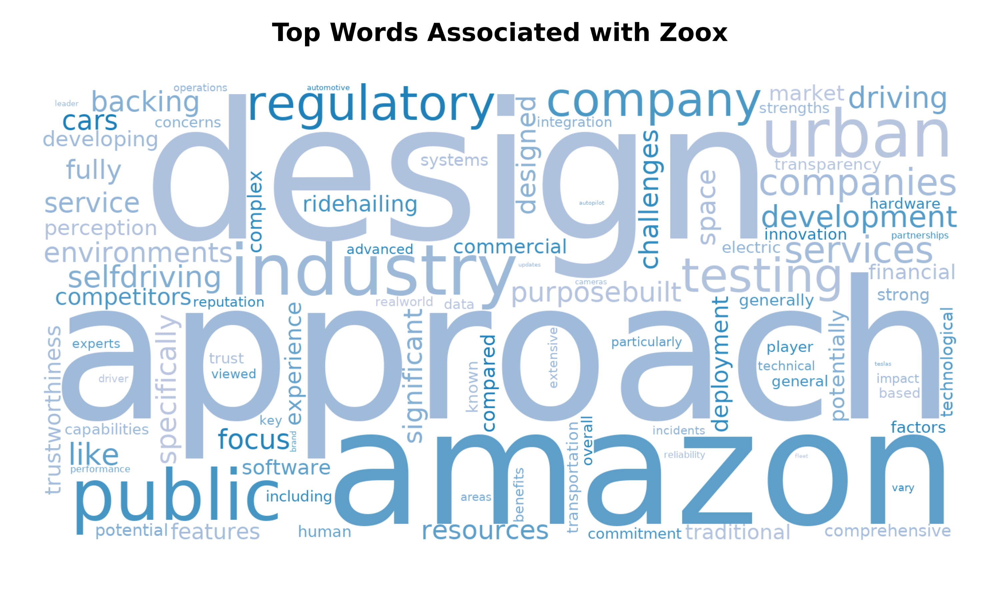

##### Company-Specific Keyword Signals:

* **Waymo**: Top keywords include public and testing, reinforcing its scale and deployment but also suggesting an impersonal, infrastructure-level image.
* **Tesla**: Keywords like feature and self-driving show it is seen as a driver support system, not a full-service robotaxi — which may dilute its positioning.
* **Cruise**: The dominant keyword regulatory likely reflects recent public setbacks around permits and operations, which could be influencing sentiment tone.
* **Zoox**: Uniquely shows words like design and approach, pointing to its distinctiveness and futuristic product philosophy — aligning with its radar chart strength in the Service category.

##### Interpretation:

* **Tesla and Cruise** are caught in a branding overlap between driver-assist products and robotaxi services. LLMs may penalize this lack of clarity, assigning them to the wrong mental category.
* **Zoox**, despite not being fully launched, benefits from having a clear design-centric narrative — positioning it as an innovator.

---

## Final Summary & Limitations

This project demonstrates how LLMs describe, rank, and emotionally evaluate companies in the robotaxi space. It also shows that structured category dominance does **not guarantee positive sentiment** , and that **LLMs reflect not just data, but public narrative context** .

### Key Takeaways:

* **Waymo** ranks #1 in technical and categorical charts, yet is not as successful in having **positive sentiment** due to generalized skepticism embedded in its descriptions.
* **Filtered word clouds** reveal the **narrative identity** of each brand, from Zoox’s *design-first innovation* to Tesla’s *driver-assist framing* .
* **Narrative control matters** — companies must proactively shape how they are described across different LLMs to avoid misalignment.

### Limitations

1. **LLM Variability**: Responses can differ day-to-day as models update. This might introduce minor **inconsistencies** in ranking or tone analysis.
2. **Sample Size**: We tested a limited set of prompts and repeated them only across GPT-4 and Claude. A broader set of LLMs and queries could strengthen the robustness of findings.
3. **Subjectivity in Sentiment**: While numeric scoring helps, sentiment analysis can still be influenced by the language model’s inherent biases or training data.
4. **External Factors**: Public sentiment may shift rapidly with news events (e.g., accidents or regulatory announcements). Real-time brand perception can differ from this snapshot.

### Next Steps

1. **Expand the Prompt Set**: Increase the total number of queries by threefold to capture a broader range of user intents and industry-relevant keywords.
2. **Adopt Fine-Grained NLP**: Implement more advanced sentiment frameworks and Named Entity Recognition (NER) to differentiate references to specific product lines, city deployments, or safety metrics.
3. **Integrate Additional LLMs**: Compare emerging AI models (e.g., Bing Chat, Perplexity) to see how brand perceptions vary across multiple platforms.
4. **Develop Automated Dashboards**: Migrate analyses into an interactive format for real-time exploration of LLM-based brand sentiment.
